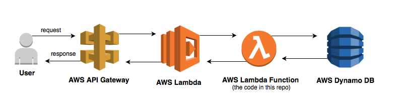

# λ Example AWS Lambda Service

A fictional movie recommendation service demonstrating how to build AWS Lambda apps. 

> Written in Java 8 using the AWS Java SDK

## Architecture



## API endpoints

### Recommendations

#### Description

List movie recommendations for a user. Max 10 movies are returned. 

#### Request

```
GET /recommendations/{userId}
```

#### Response
200 OK status
 
```json
[
  {
    "imdbId": "tt4125428",
    "title": "Daredevil",
    "imdbRating": 4.7,
    "mostFrequentGenre": "Drama",
    "mostFrequentKeyword": "character-name-in-title",
    "isAdult": false,
    "releaseYear": 2015
  },
  {
    "imdbId": "tt4799588",
    "title": "eps1.8_m1rr0r1ng.qt",
    "imdbRating": 4.65,
    "mostFrequentGenre": "Drama",
    "mostFrequentKeyword": "character-name-in-title",
    "isAdult": false,
    "releaseYear": 2015
  },
  {
    "imdbId": "tt3466756",
    "title": "Figs for Italo",
    "imdbRating": 4.6,
    "mostFrequentGenre": "Drama",
    "mostFrequentKeyword": "character-name-in-title",
    "isAdult": false,
    "releaseYear": 2015
  }
]
```

### Reviews

#### Description

Post a new review for a user. Update an existing review for a user.

#### Request

```
PUT /review/{userId}/{imdbId}
```

```json
{
	"rating": 4.5
}
```

#### Response
200 OK status

```json
{
	"userId": "fc265cae-e4ea-11e7-80c1-9a214cf093ae",
	"createdAt": 1512427153356,
	"rating": 4.5,
	"updatedAt": 1512427153356,
	"imdbId": "tt1856101"
}
```

#### Description

Delete an existing review for a user. 

#### Request

```
DELETE /review/{userId}/{imdbId}
```

#### Responses

200 OK status

```json
{
	"userId": "fc265cae-e4ea-11e7-80c1-9a214cf093ae",
	"createdAt": 1512427153356,
	"rating": 4.5,
	"updatedAt": 2512427153356,
	"imdbId": "tt1856101"
}
```
#### Description

List all reviews of a user. 

#### Request

```
GET /reviews/{userId}?count=5&paginationToken=tt0000414%232018-01-05T00:24:49.969Z
```

#### Responses
200 OK status

```json
{
	"results": [{
		"userId": "edb2345a-adf5-4c17-858f-16308e1fc20a",
		"imdbId": "tt0000300",
		"rating": 5.0,
		"createdAt": 1515112458467,
		"updatedAt": 1515112458467,
		"version": 1
	}, {
		"userId": "edb2345a-adf5-4c17-858f-16308e1fc20a",
		"imdbId": "tt0000414",
		"rating": 5.0,
		"createdAt": 1515111889969,
		"updatedAt": 1515111889983,
		"version": 1
	}],
	"paginationToken": "tt0000414#2018-01-05T00:24:49.969Z"
}
```

## License

MIT © Ivan Mwiruki